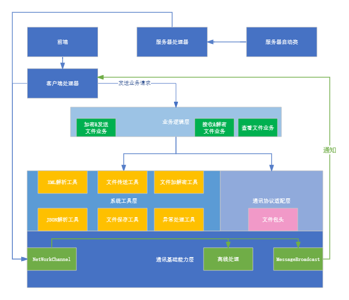
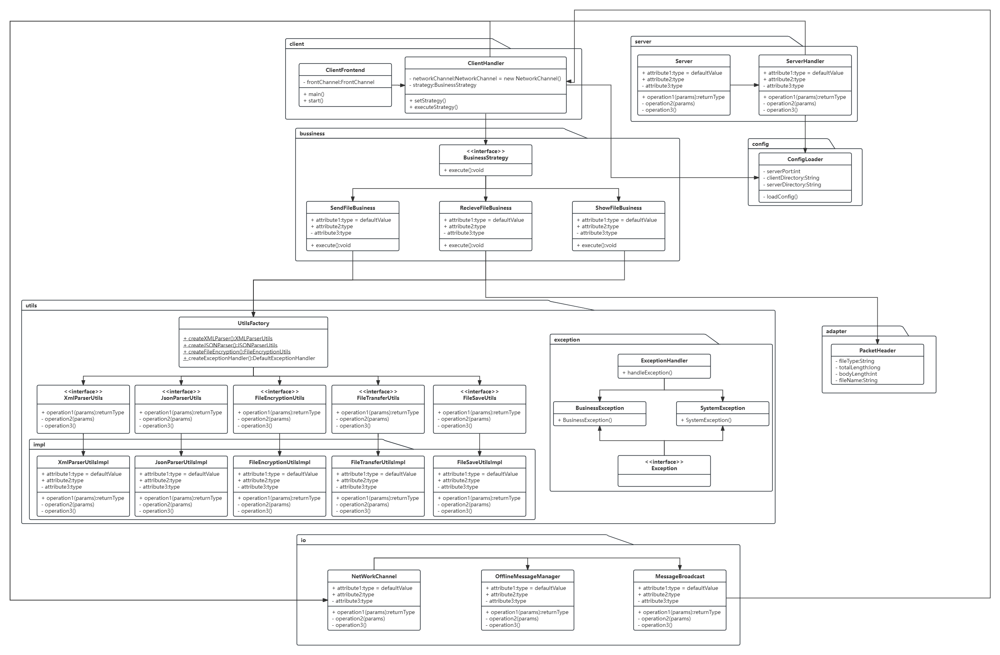
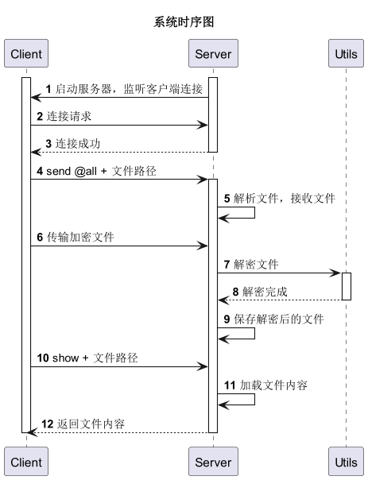
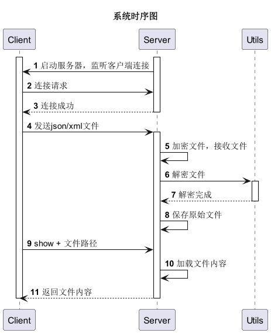
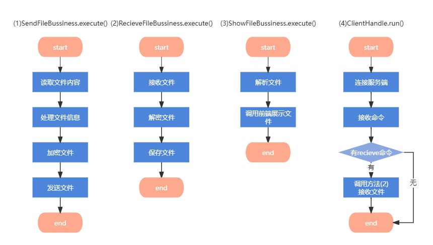

# 多用户文件传输系统设计文档

## 设计目标

该文档旨在设计一个基于Java的简易文件传输系统，满足以下目标：

1. 多用户连接和文件传输：实现一个支持多个用户连接到服务器，并能够发送文件和展示文件的系统。
2. 数据安全性：确保文件在传输过程中被加密，接收后自动解密还原初始文件。
3. 文件解析和展示：支持用户在服务器端和客户端查看接收到的XML和JSON文件内容。
4. 系统稳定性和可扩展性：通过使用设计模式（2种以上）、多线程处理、异常处理等手段，保证系统的稳定性和可扩展性。

## 系统框架

## 系统类图

## 系统时序图

## 系统的数据结构

#### ClientHandler 类

描述 ClientHandler 类用于处理客户端的特定逻辑，包括发送和接收消息，处理离线消息等。

属性

- networkChannel: NetworkChannel 类型，私有。表示客户端与服务器的网络通道。
- businessStrategy: BusinessStrategy 类型，私有。用于选择和执行具体的业务逻辑。

方法

- ClientHandler(): 构造函数，初始化一个新的 ClientHandler 对象，并与服务器建立连接。
- handleRequest(String request): 处理客户端请求的方法，根据请求类型选择并执行相应的业务逻辑。
  - 参数: request (String) - 客户端请求。
- sendToServer(byte\[] data): 向服务器发送数据的方法。
  - 参数: data (byte\[]) - 要发送的数据。
  - 抛出异常: IOException - 发送数据过程中可能抛出的异常。
- receiveFromServer(): 从服务器接收数据的方法。
  - 返回值: byte\[] - 接收到的数据。
  - 抛出异常: IOException - 接收数据过程中可能抛出的异常。

#### ServerHandler 类

描述 ServerHandler 类用于处理服务器端的特定逻辑，包括接受客户端连接和处理离线消息。

属性

- messageBroadcast: MessageBroadcast 类型，私有。用于管理和通知所有客户端观察者。
- offlineMessageManager: OfflineMessageManager 类型，私有。用于管理离线消息。

方法

- ServerHandler(): 构造函数，初始化一个新的 ServerHandler 对象。
- handleRequest(String request): 处理服务器端请求的方法。
  - 参数: request (String) - 服务器端请求。
- registerClient(ClientHandler clientHandler): 注册客户端观察者的方法。
  - 参数: clientHandler (ClientHandler) - 要注册的客户端观察者。
- unregisterClient(ClientHandler clientHandler): 注销客户端观察者的方法。
  - 参数: clientHandler (ClientHandler) - 要注销的客户端观察者。

#### NetworkChannel 类

描述 NetworkChannel 类负责处理基本的网络通信功能，包括初始化客户端和服务器的网络连接，发送和接收数据等操作。

属性

- socketChannel: SocketChannel 类型，私有。表示客户端与服务器的 Socket 连接。
- selector: Selector 类型，私有。用于管理多个通道的选择器。

方法

- initClient(String host, int port): 初始化客户端网络通道的方法。
  - 参数: host (String) - 服务器主机名。
  - 参数: port (int) - 服务器端口号。
  - 抛出异常: IOException - 初始化过程中可能抛出的异常。
- sendData(byte\[] data): 发送数据的方法。
  - 参数: data (byte\[]) - 要发送的数据。
  - 抛出异常: IOException - 发送数据过程中可能抛出的异常。
- receiveData(): 接收数据的方法。
  - 返回值: byte\[] - 接收到的数据。
  - 抛出异常: IOException - 接收数据过程中可能抛出的异常。

#### MessageBroadcast 类

描述 MessageBroadcast 类实现观察者模式，用于一对多发送文件。它管理多个观察者（客户端），并在有新消息时通知所有观察者。

属性

- observers: List\<Observer> 类型，私有。用于存储所有注册的观察者。

方法

- addObserver(Observer observer): 添加观察者的方法。
  - 参数: observer (Observer) - 要添加的观察者。
- removeObserver(Observer observer): 移除观察者的方法。
  - 参数: observer (Observer) - 要移除的观察者。
- notifyObservers(byte\[] data): 通知所有观察者的方法。
  - 参数: data (byte\[]) - 要通知的数据。

#### OfflineMessageManager 类

描述 OfflineMessageManager 类管理离线消息，确保当客户端离线时，消息可以存储并在客户端上线后发送给它。

属性

- offlineMessages: Map\<String, List\<byte\[]>> 类型，私有。用于存储离线消息。

方法

- storeMessage(String username, byte\[] message): 存储离线消息的方法。
  - 参数: username (String) - 用户名。
  - 参数: message (byte\[]) - 要存储的消息。
- retrieveMessages(String username): 获取离线消息的方法。
  - 返回值: List\<byte\[]> - 获取的离线消息。
- hasMessages(String username): 检查是否有离线消息的方法。
  - 返回值: boolean - 是否有离线消息。

### ExceptionHandler 类

描述 ExceptionHandler 类用于处理不同类型的异常，并记录相应的日志信息。

属性

- logger: 静态私有 Logger 对象，用于记录日志。

方法

- handleException(Throwable e): 处理通用异常的方法，根据不同类型的异常分别调用对应的处理方法。
- handleServiceException(ServiceException e): 处理业务异常的方法，记录错误码和错误消息。
- handleNullPointerException(NullPointerException e): 处理空指针异常的方法，记录错误消息和异常信息。
- handleIOException(IOException e): 处理 IO 异常的方法，记录错误消息和异常信息。
- handleException(Exception e): 处理其他类型异常的方法，记录错误消息和异常信息。

## 主要方法的流程图

